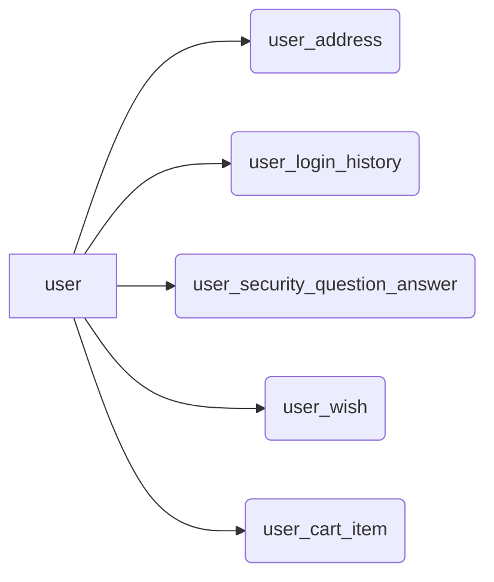
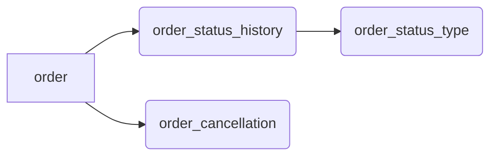
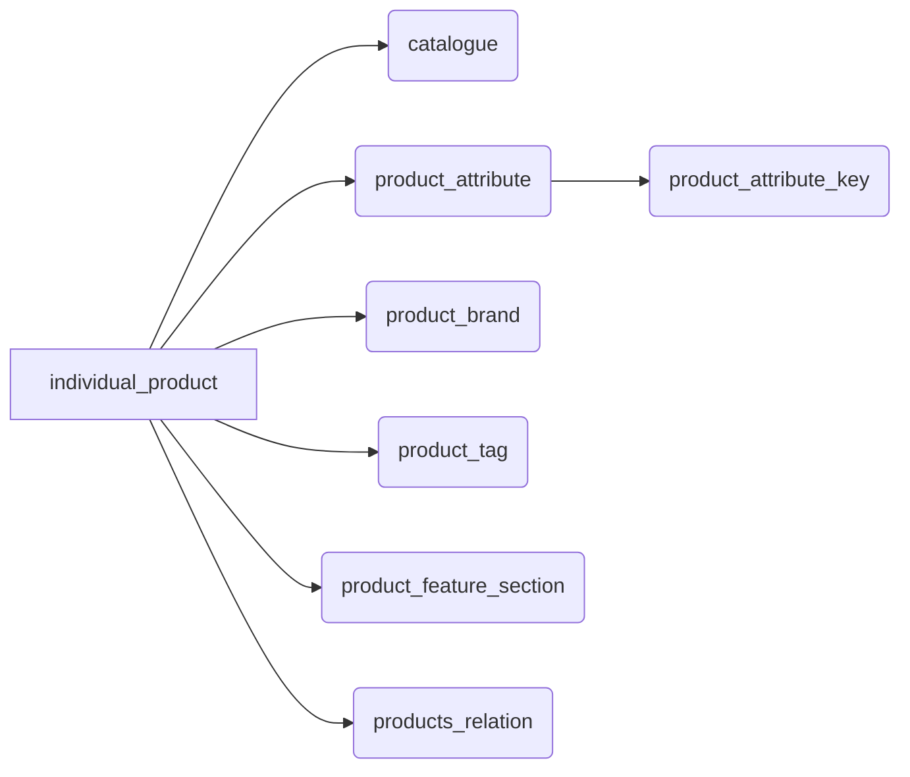
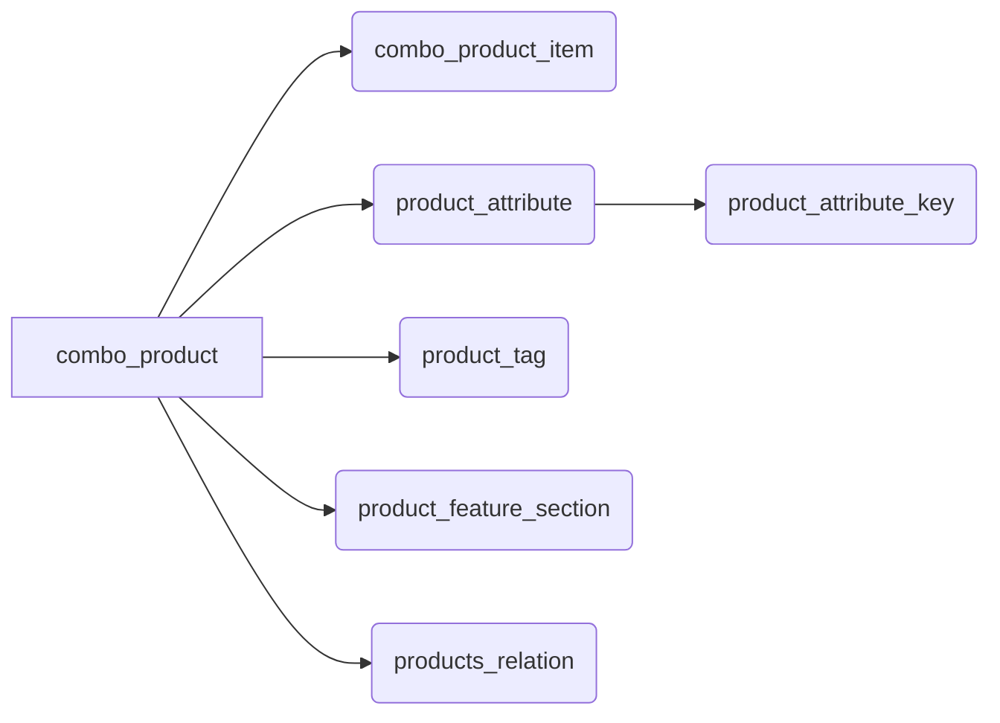
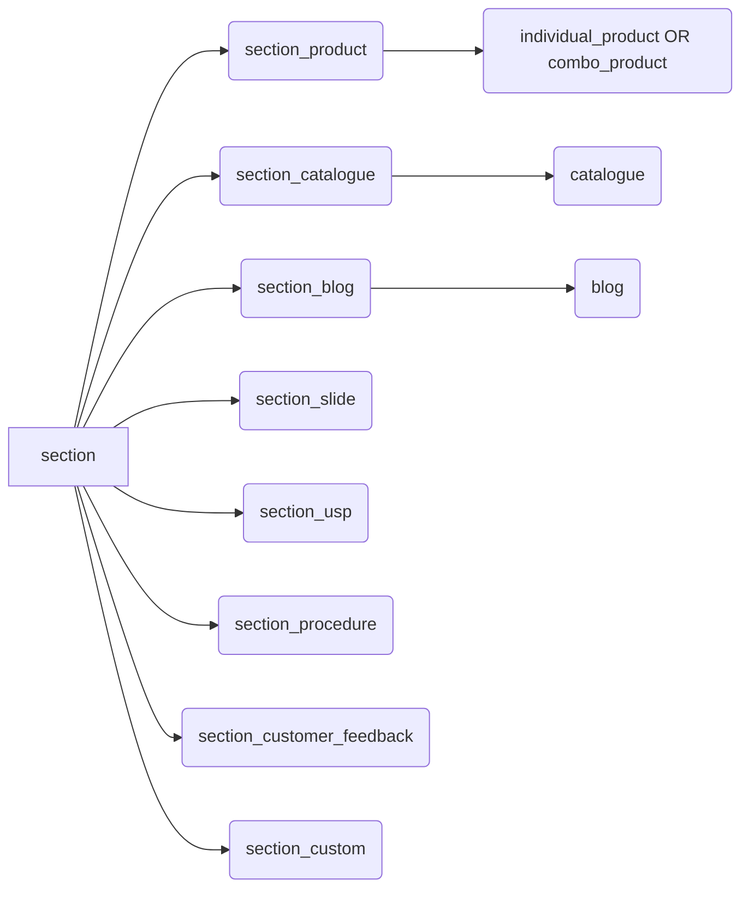
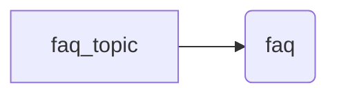

The database used here is MySQL. So let's go through each table and understand its responsibility.

## User 

User-related tables.

Table | Responsibility
--- | ---
user | Holds user information such as `id`, `name`, etc...
user_address | Holds user addresses. There can be multiple addresses associated with a user.
user_login_history | Maintains a record of user logins. 
user_security_question_answer | Holds answers of user's selected security questions. Looks up to `security_question` for question reference.
user_password_hint | Holds user's password hints. *This feature was deactivated due to security concerns.*
user_wish | Holds user's product wishlist.
user_cart_item | Holds user's cart products. 

## Order 

Order-related tables.

Table | Responsibility
--- | ---
order_status_type | Holdes status list supported by an order. This is a lookup table. For eg. <ul><li>RECEIVED</li><li>PROCESSING</li><li>DISPATCHED</li><li>DELIVERED</li><li>CANCELLED</li></ul> You can add you own mapping here.
order_status_history | Each order has a lifecycle from receiving an order to getting cancelled. This table maintains the very same lifecycle and uses status for it. Looks up to `order_status_type` for status reference.
order | Holds all the information of an order. Few top-level data points: <ul><li>Order summary such as `sale amount`, `retail amount`, `discount`, `total`, etc...</li><li>A snapshot of user's cart during order placement time.</li><li>User and their address.</li><li>Currency</li><li>Third party payment ID</li><li>Payment type (`CARD`, `WALLET`)</li><li>Status text</li><li>Cancellation ID (if any)</li></ul>
order_cancellation | Holds order's cancellation reason.

## Catalogue
Table | Responsibility
--- | ---
catalogue | All individual products are associated with a catalogue. This table holds catalogue information such `name`, `images`, etc...

## Product
A product can be of 2 types:
- Individual 
- Combo

### Individual Product

Table | Responsibility
--- | ---
individual_product | Holds individual product information. Few data points: <ul><li>Basic information such `name`, `shortName`, `description`</li><li>SEO-related information such `seoTitle`, `seoDescription`, `seoKeywords`</li><li>Catalogue</li><li>Images (fetched from `image` table)</li><li>Brand</li><li>Other related products</li><li>Feature sections</li><li>Attributes</li><li>Tags</li></ul>

### Combo Product
Combo products are made up of multiple products. For eg. A `Men winter suit` combo product can have the following product items
- `Sweatshirt`
- `Jacket`
- `Beanie`
- `Gloves `

Combo products dont' have
- catalogue
- brand

Table | Responsibility
--- | ---
combo_product | Holds combo product information. Few data points: <ul><li>Basic information such `name`, `shortName`, `description`</li><li>SEO-related information such `seoTitle`, `seoDescription`, `seoKeywords`</li><li>Images (fetched from `image` table)</li><li>Other related products</li><li>Feature sections</li><li>Attributes</li><li>Tags</li></ul>
combo_product_item | Holds product items for a combo product.

### Product properties

Table | Responsibility
--- | ---
product_attribute_key | A list of all attribute keys supported by the app. Few attribute key examples for a car: <ul><li>Mileage</li><li>Color</li><li>Dimension</li><li>Variant</li><li>No. of seats</li></ul>  This is a lookup table.
product_attribute | Maintains a list of all attributes for a **product**. Looks up to `product_attribute_key` for reference.
product_brand | Holds the list of all the supported brands. This is a lookup table. 
product_tag | Holds tags for a product. Few tag examples: <ul><li>Highly Rated</li><li>Verified</li><li>New</li><li>Trending</li><li>etc...</li></ul> 
product_feature_section | A feature section is an expandable section with some detailed information about a product. This table holds feature sections for a product.
products_relation | This table holds product relations. A relation can have both individual and combo products. 

## Section
A section is a component which can have multiple items. There can be different types of sections.
- Products section (For products)
- Catalogues section (For catalogues)
- Blogs section (For blogs)
- Full-width slides section (For slides which will cover the full screen. Will be used as slides)
- Strict-width slides section (For slides which will have 640x300 size. Will be used as slides)
- USPs section (To showcase app USPs. **Note:** Max 4)
- Procedures section (To showcase the process)
- Customer feedbacks section (For displaying customer feedbacks)
- Share section (For asking users to share the app)
- Custom section (For rendering any custom section. Accepts raw HTML)

For eg. If `type` of a section is `PRODUCTS`, it will lookup products from `section_product` table.

Table | Responsibility
--- | ---
section | This is where all the sections are stored. Few data points: <ul><li>Name</li><li>Title</li><li>SubTitle</li><li>Type (`PRODUCTS`, `CATALOGUES`, `BLOGS`, etc...). Used to decide the type of the section.</li></ul>
section_product | Holds products for `Products` section
section_catalogue | Holds catalogues for `Catalogues` section
section_blog | Holds blogs for `Blogs` section
section_slide | Holds slides for both `Full-width slides` and `Strict-width slides` sections.
section_usp | Holds data for `USPs` section
section_procedure | Holds data for `Procedures` section
section_customer_feedback | Holds data for `Customer Feedbacks` section
section_custom | Holds data for `Custom` section

## Page Sections
You can use multiple sections on a page. Also you can override the default properties of a section such as `title`, `subTitle`, etc... only for a page.

Table | Responsibility
--- | ---
section_page_home | Sections to show on home page
section_page_explore | Sections to show on explore page
section_page_error | Sections to show on error page
section_page_individual_product | Sections to show on individual product page
section_page_combo_product | Sections to show on combo product page
section_page_search | Sections to show on search page

## Supported Regions 
**Note:** There's no validation of city-to-country mapping at system-level, so pls add cities only of the supported countries. For eg. don't add `Mumbai` if `India` country is not supported.

Table | Responsibility
--- | ---
supported_country | Holds the list of countries the app supports.
supported_city | Holds the list of cities the app supports. If the app is servicable only in `Mumbai`, then kindly add `India` as country and `Mumbai` as city. 

## FAQ

Table | Responsibility
--- | ---
faq_topic | Each FAQ is grouped with a topic such as `general`, `payment`, etc.. This table holds the very same topics.
faq | All the FAQs are stored here with corresponding topic ID.

## HTML Pages
Table | Responsibility
--- | ---
page_tn_c | Content for the `Terms and Conditions page`. Purely raw HTML.
page_privacy_policy | Content for the `Privacy Policy page`. Purely raw HTML.
page_refund_policy | Content for the `Refund Policy page`. Purely raw HTML.

## Others
Table | Responsibility
--- | ---
currency | Holds currency supported by the product. There can be only 1 row.
security_question | Holds all the security questions. This is a lookup table.
blog | Holds all the information for a blog.
image | This is a global table which holds all the dynamic images from product to slides. Few top-level data: <ul><li>Image URL path (just the path, not the absolute URL. Base URL is added at consumer level.)</li><li>Dimensions</li><li>Size in bytes</li></ul>

