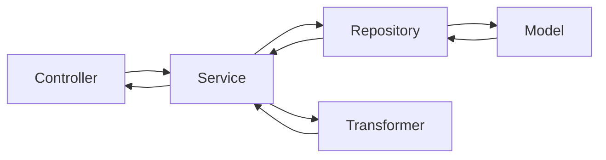

## Directories
A description of top-level directories.

Directory | Description
--- | ---
`/env` | For ENV files.
`/src/server` | Only for server related handling.
`/src/server/controller` | Holds all the supported HTTP endpoints.
`/src/app` | This directory has all app-related files. 
`/src/app/constants` | For app constants.
`/src/app/contract` | A contract consumers will use for business logic.
`/src/app/decorators` | We use few decorators to enhance a method without modifying its interface.
`src/app/errors` | We have extended `Error` class for more custom handling.
`src/app/models` | These are TypeORM models. Basically a representation of a MySQL table.
`src/app/repositories` | Contains repositories which are used to perform DB operations through TypeORM.
`src/app/services` | For all services.
`src/app/transformers` | Holds methods which transform a data into a contract.
`src/app/utils` | Contains both contextual as well as pure methods.
`/dist` | For build files.

## Core Layers
There are 5 core layers in this project and each layer has a responsibility.
- Controller
- Service
- Repository
- Model
- Transformer

Kindly go through this [blog](https://softwareontheroad.com/ideal-nodejs-project-structure/).

==- Controller
Handles incoming request and only interacts with service. 
Can be found in `src/server/controller`
==-

==- Service
These are pure methods and don't accept any global or contextual values/params. Their responsibility is to return the required data to any consumer not specifically just the controller. Services interact with 
- repositories for fetching data
- transformers for tranforming data into a contract

Can be found in `src/app/services`
==-

==- Repository
Their responsibility is to do DB-related operations.
Can be found in `src/app/repositories`
==-

==- Model
Specifies DB table contract.
Can be found in `src/app/models`
==-

==- Transformers
Since each endpoint returns data in form of a contract, it is transformer's responsibility is to prepare that contract.
Can be found in `src/app/transformers`
==-
